# Credit Card Payment Checkout

Monorepo for a coffee shop credit card payment checkout experience.

- `app/` — Expo React Native mobile app (Redux, encrypted transaction storage, Jest tests)
- `api/` — NestJS backend API (hexagonal architecture, Postgres, payment gateway integration)

## Architecture

High-level view of the system and how each component communicates.

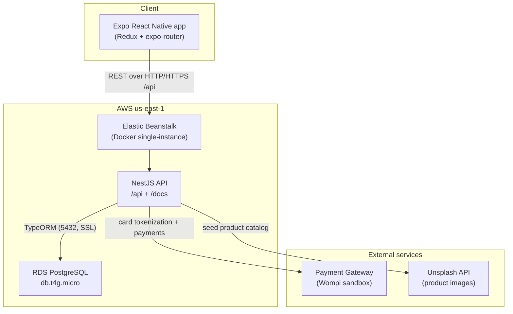

Request flow for a purchase:

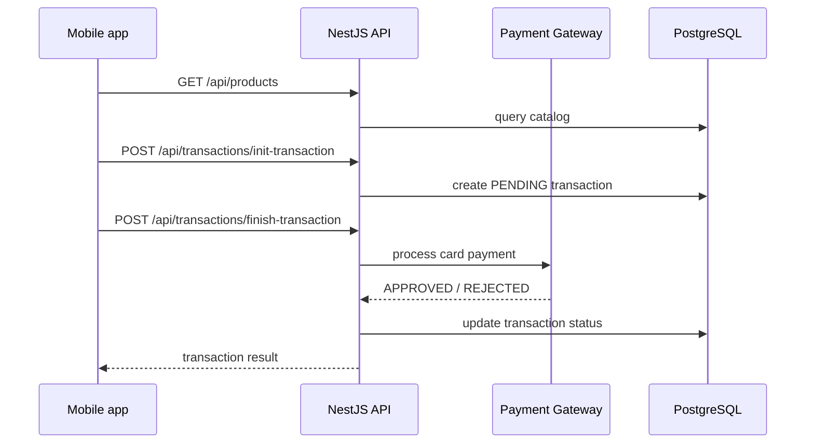

## Mobile app screenshots

| Screen           | Description                                | Screenshot                                              |
| ---------------- | ------------------------------------------ | ------------------------------------------------------- |
| Home             | Product catalog with search and pagination | 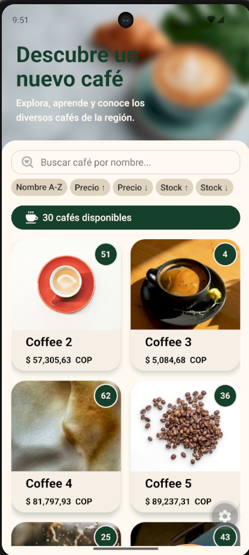                     |
| Home (search)    | Filtered product list                      | 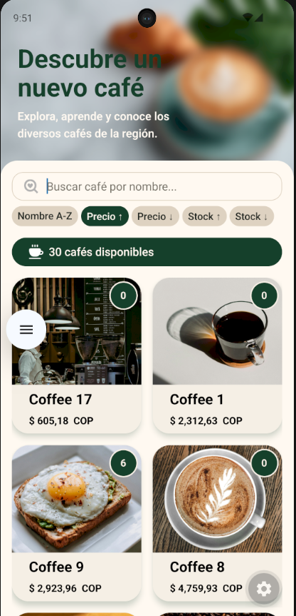              |
| Home (sort)      | Sorted product list                        | 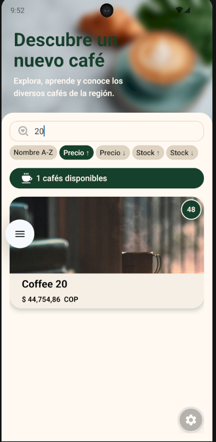                |
| Product detail   | Coffee details and checkout entry          | 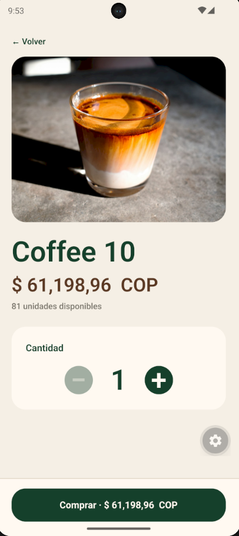           |
| Presigned        | Document acceptance before payment         | 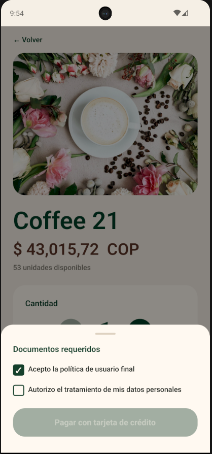             |
| Payment form     | Credit card input and validation           | 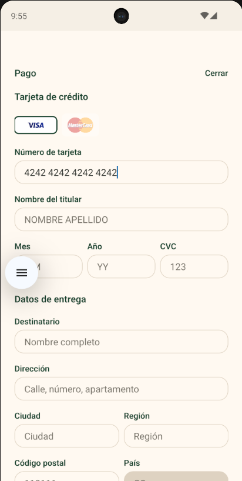               |
| Payment summary  | Order review before confirming             | 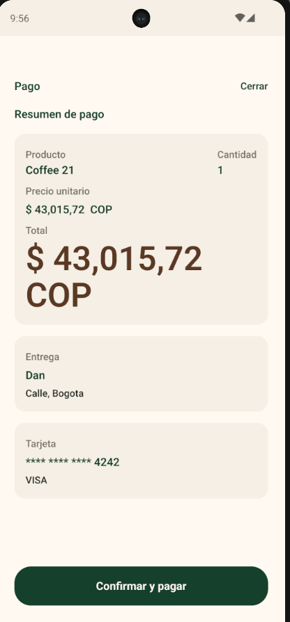 |
| Payment pending  | Transaction processing state               | 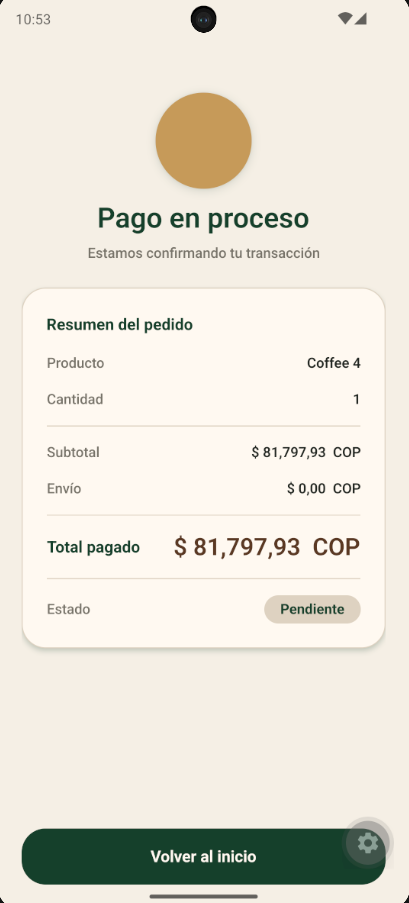     |
| Payment approved | Successful transaction                     | 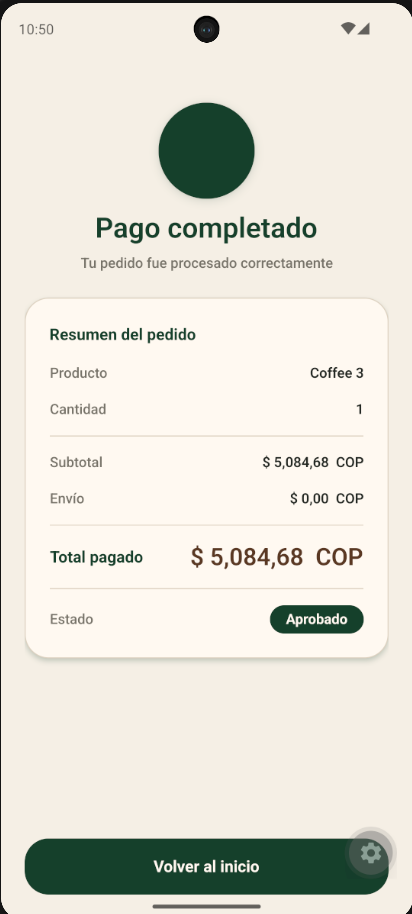   |
| Payment rejected | Failed transaction                         | 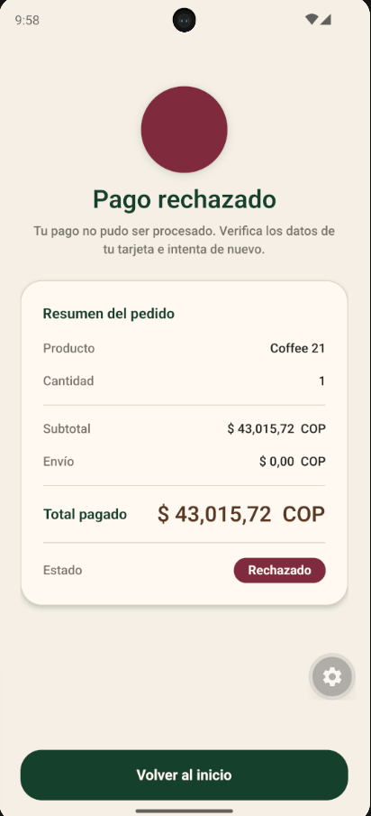   |

## Quick start

### 1. Backend API

```bash
cd api
cp .env.example .env
docker compose up -d postgres
npm install
npm run migration:run
npm run start:dev
```

API: `http://localhost:3000/api`  
Swagger: `http://localhost:3000/docs`

### 2. Mobile app

```bash
cd app
cp .env.example .env
# Set EXPO_PUBLIC_API_URL=http://<your-ip>:3000/api for physical devices
npm install
npm start
```

## Test coverage

### Mobile (`app/`)

```bash
cd app
npm test
npm run test:cov
```

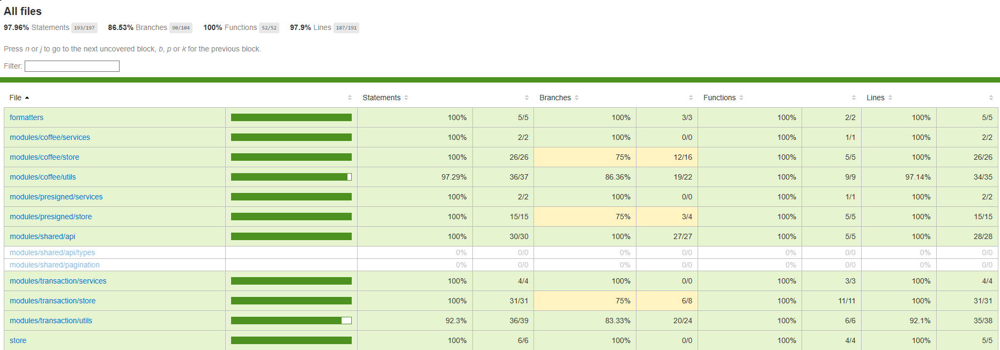

### Backend (`api/`)

```bash
cd api
npm test
npm run test:cov
```


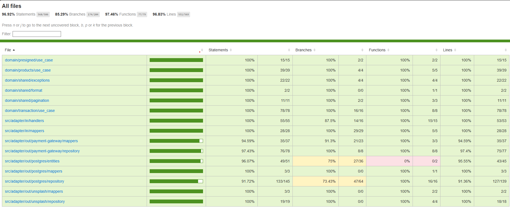

## Docker (full stack)

```bash
cd api
docker compose up --build
```

## Android APK build

For a local APK (requires Android SDK):

```bash
cd app
npx expo prebuild --platform android
cd android && ./gradlew assembleRelease
```

The release APK is generated at `android/app/build/outputs/apk/release/`.

## Project structure

```
credit_card_payment_checkout/
├── app/          # Expo mobile app
├── api/          # NestJS API
└── README.md
```

## Environment variables

See `api/.env.example` and `app/.env.example`.

Payment gateway credentials use neutral `PAYMENT_GATEWAY_*` variable names.

## Documentation

### Project docs

- [Backend API README](api/README.md) — setup, endpoints, AWS deploy
- [Mobile app README](app/README.md) — setup, features, APK build
- [APK builds README](builds/README.md) — local release build steps
- Live Swagger / OpenAPI: `http://payment-checkout-api-dev.eba-bpgvahsh.us-east-1.elasticbeanstalk.com/docs`

### External references

- [NestJS](https://docs.nestjs.com/) · [TypeORM](https://typeorm.io/) · [PostgreSQL](https://www.postgresql.org/docs/)
- [Expo (v57)](https://docs.expo.dev/versions/v57.0.0/) · [React Native](https://reactnative.dev/docs/getting-started) · [expo-router](https://docs.expo.dev/router/introduction/) · [Redux Toolkit](https://redux-toolkit.js.org/)
- [Wompi payment gateway](https://docs.wompi.co/) · [Unsplash API](https://unsplash.com/documentation)
- [AWS Elastic Beanstalk](https://docs.aws.amazon.com/elasticbeanstalk/) · [Amazon RDS for PostgreSQL](https://docs.aws.amazon.com/AmazonRDS/latest/UserGuide/CHAP_PostgreSQL.html)
