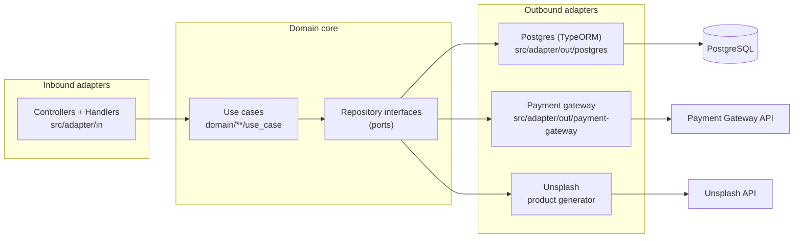

# Backend API

NestJS + TypeScript credit card payment API with hexagonal architecture, Postgres, and external payment gateway integration.

## Requirements

- Node.js 20+
- Docker (for Postgres)
- Payment gateway sandbox credentials

## Setup

```bash
npm install
cp .env.example .env
```

Fill `.env` with database and payment gateway credentials:

```
DB_HOST=localhost
DB_PORT=5432
DB_USERNAME=postgres
DB_PASSWORD=postgres
DB_DATABASE=products-api

PAYMENT_GATEWAY_API_URL=
PAYMENT_GATEWAY_PUBLIC_KEY=
PAYMENT_GATEWAY_PRIVATE_KEY=
PAYMENT_GATEWAY_EVENTS_KEY=
PAYMENT_GATEWAY_INTEGRITY_KEY=
```

## Run with Docker

```bash
docker compose up --build
```

This starts Postgres and the API on port 3000.

## Run locally

```bash
docker compose up -d postgres
npm run migration:run
npm run seed:dev
npm run start:dev
```

- API base URL: `http://localhost:3000/api`
- Swagger docs: `http://localhost:3000/docs`

## Tests

```bash
npm test
npm run test:cov
npm run test:e2e
```

### Coverage results:


## API endpoints

| Method | Path | Description |
|--------|------|-------------|
| GET | `/api/products` | List products with filters/pagination |
| GET | `/api/presigned` | Get acceptance documents |
| POST | `/api/transactions/init-transaction` | Create pending transaction |
| POST | `/api/transactions/finish-transaction` | Process payment |
| GET | `/api/transactions/approved-transaction-by-id/:id` | Get transaction by ID |

## Architecture

Hexagonal (ports and adapters) architecture. The `domain` layer holds business
logic and repository interfaces (ports); `src/adapter` provides the inbound
(HTTP) and outbound (Postgres, payment gateway, Unsplash) adapters.



Folder layout:

```
api/
├── domain/           # Use cases, models, repository interfaces (ports)
└── src/
    ├── adapter/
    │   ├── in/       # Controllers, handlers, DTOs
    │   └── out/      # Postgres, payment-gateway, Unsplash adapters
    ├── modules/      # NestJS DI wiring
    └── config/       # Database and env configuration
```

## Docker production image

```bash
docker build -t payment-checkout-api .
docker run -p 3000:3000 --env-file .env payment-checkout-api
```

## Deploy to AWS (demo)

Architecture: Elastic Beanstalk (Docker, single-instance `t3.micro`) + RDS PostgreSQL (`db.t4g.micro`).

**Prerequisites:** AWS CLI, EB CLI (`pip install awsebcli`), Docker, `aws configure`.

```bash
# Full deploy (RDS + migrations + EB + env vars + verify)
bash scripts/aws-deploy.sh all

# Or step by step:
bash scripts/aws-deploy.sh rds      # Create RDS
bash scripts/aws-deploy.sh migrate  # Run migrations from local
bash scripts/aws-deploy.sh eb       # Create EB environment
bash scripts/aws-deploy.sh env-vars # Set environment properties
bash scripts/aws-deploy.sh sg       # Allow EB -> RDS on port 5432
bash scripts/aws-deploy.sh deploy   # Deploy Docker image
bash scripts/aws-deploy.sh verify   # Health check
```

**Live endpoints:**
- API: `http://payment-checkout-api-dev.eba-bpgvahsh.us-east-1.elasticbeanstalk.com/api`
- Swagger: `http://payment-checkout-api-dev.eba-bpgvahsh.us-east-1.elasticbeanstalk.com/docs`

**Notes:**
- RDS database name must be alphanumeric (`productsapi`, not `products-api`).
- Set `DB_SSL=true` for RDS connections.
- Product seed runs automatically on API startup via `SeedProductsHandler`.
- Estimated cost: ~$30-40/month (us-east-1).

## Scripts

| Script | Description |
|--------|-------------|
| `npm run start:dev` | Start with hot reload |
| `npm run build` | Compile TypeScript |
| `npm run start:prod` | Run compiled app |
| `npm test` | Unit tests |
| `npm run test:cov` | Coverage report |
| `npm run migration:run` | Apply DB migrations |
| `npm run seed:dev` | Seed initial products |

## Documentation

- Interactive API docs (Swagger UI): `/docs` (e.g. `http://localhost:3000/docs`)
- [Root project README](../README.md) — system architecture overview
- [Mobile app README](../app/README.md)

### Frameworks & services

- [NestJS](https://docs.nestjs.com/) — modules, providers, dependency injection
- [TypeORM](https://typeorm.io/) — entities, migrations, data source
- [Swagger / OpenAPI (`@nestjs/swagger`)](https://docs.nestjs.com/openapi/introduction)
- [class-validator](https://github.com/typestack/class-validator) — DTO validation
- [Wompi payment gateway](https://docs.wompi.co/) — sandbox tokenization & transactions
- [Unsplash API](https://unsplash.com/documentation) — product catalog images

### Deployment

- [AWS Elastic Beanstalk (Docker)](https://docs.aws.amazon.com/elasticbeanstalk/latest/dg/docker.html)
- [EB CLI reference](https://docs.aws.amazon.com/elasticbeanstalk/latest/dg/eb-cli3.html)
- [Amazon RDS for PostgreSQL](https://docs.aws.amazon.com/AmazonRDS/latest/UserGuide/CHAP_PostgreSQL.html)
