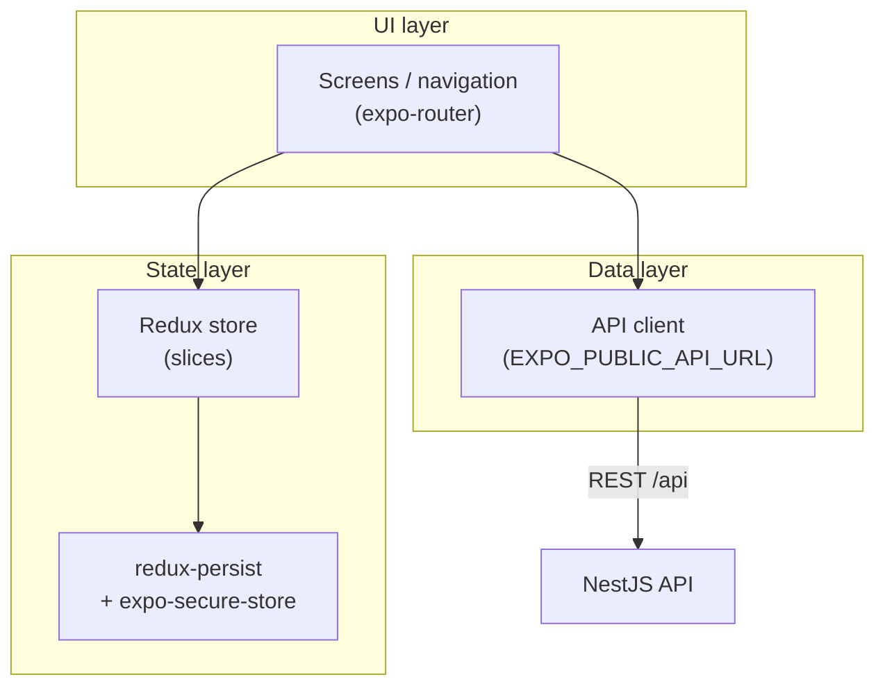

# Mobile App

Expo React Native coffee checkout app with Redux, encrypted transaction persistence, and full payment flow.

## Architecture

The UI is built with `expo-router` screens. State lives in a Redux store that is
persisted (encrypted) via `redux-persist` + `expo-secure-store`. A thin API layer
talks to the backend using `EXPO_PUBLIC_API_URL`.



## Requirements

- Node.js 24+
- Expo CLI
- Backend API running (see `../api/README.md`)

## Setup

```bash
npm install
cp .env.example .env
```

Set `EXPO_PUBLIC_API_URL` in `.env`:

- ios:

```
EXPO_PUBLIC_API_URL=http://localhost:3000/api
```

- android:

```
EXPO_PUBLIC_API_URL=http://10.0.2.2:3000/api
```

Use your machine LAN IP instead of `localhost` when testing on a physical device.

## Run

```bash
npm start
npm run android
npm run ios
```

## Tests

```bash
npm test
npm run test:cov
```

### Coverage results


18 test suites, 74 tests passed. Coverage is scoped to business logic in `src/modules`, `src/store`, and `src/formatters`.


## Features

- Product catalog with search, sort, and pagination
- Presigned document acceptance + credit card checkout
- Card validation (Luhn, expiry, CVV, Visa/Mastercard detection with logos)
- Encrypted transaction persistence via `expo-secure-store` + `redux-persist`
- Dedicated transaction status screen at `/transaction/status`
- Responsive layout with `MaxContentWidth` (800px) for tablets/desktop web

## Screenshots

| Screen | Description | Screenshot |
| ------ | ----------- | ---------- |
| Home | Product catalog with search and pagination |  |
| Home (search) | Filtered product list |  |
| Home (sort) | Sorted product list |  |
| Product detail | Coffee details and checkout entry |  |
| Presigned | Document acceptance before payment |  |
| Payment form | Credit card input and validation |  |
| Payment summary | Order review before confirming |  |
| Payment pending | Transaction processing state |  |
| Payment approved | Successful transaction |  |
| Payment rejected | Failed transaction |  |

## Build APK

### Local build

```bash
npx expo prebuild --platform android
cd android
./gradlew assembleRelease
```

Output: `android/app/build/outputs/apk/release/app-release.apk`

## Project scripts

| Script             | Description                    |
| ------------------ | ------------------------------ |
| `npm start`        | Start Expo dev server          |
| `npm run android`  | Run on Android emulator/device |
| `npm run ios`      | Run on iOS simulator/device    |
| `npm test`         | Run Jest unit tests            |
| `npm run test:cov` | Run tests with coverage report |
| `npm run lint`     | Run ESLint                     |

## Documentation

- [Root project README](../README.md) — system architecture overview
- [Backend API README](../api/README.md) — endpoints consumed by this app

### Frameworks & tools

- [Expo (v57)](https://docs.expo.dev/versions/v57.0.0/) — versioned SDK docs
- [expo-router](https://docs.expo.dev/router/introduction/) — file-based navigation
- [React Native](https://reactnative.dev/docs/getting-started)
- [Redux Toolkit](https://redux-toolkit.js.org/) · [redux-persist](https://github.com/rt2zz/redux-persist)
- [expo-secure-store](https://docs.expo.dev/versions/latest/sdk/securestore/) — encrypted persistence
- [EAS Build](https://docs.expo.dev/build/introduction/) — cloud builds (see `eas.json`)
